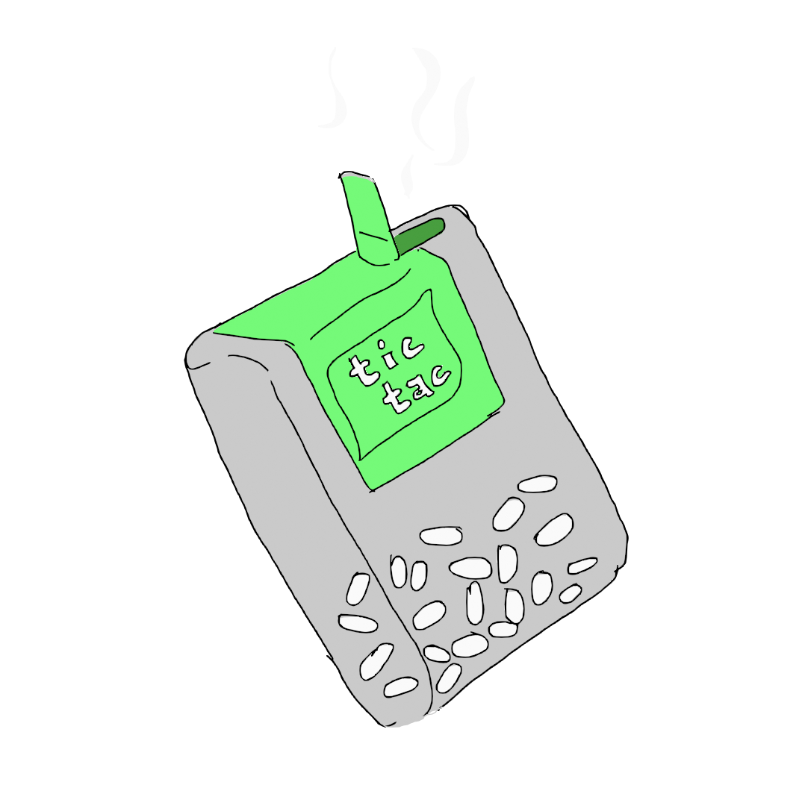
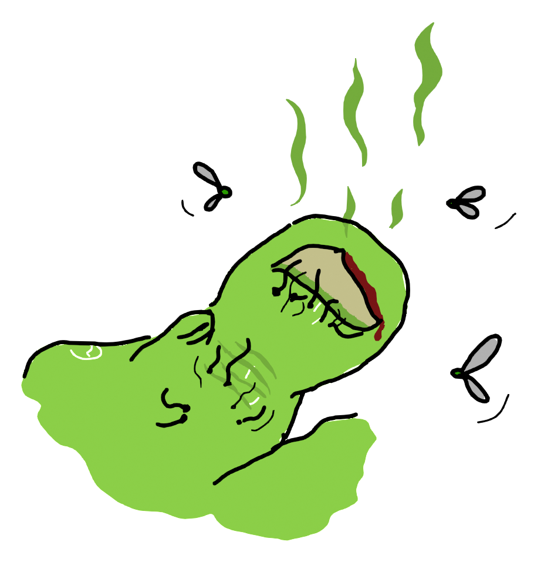
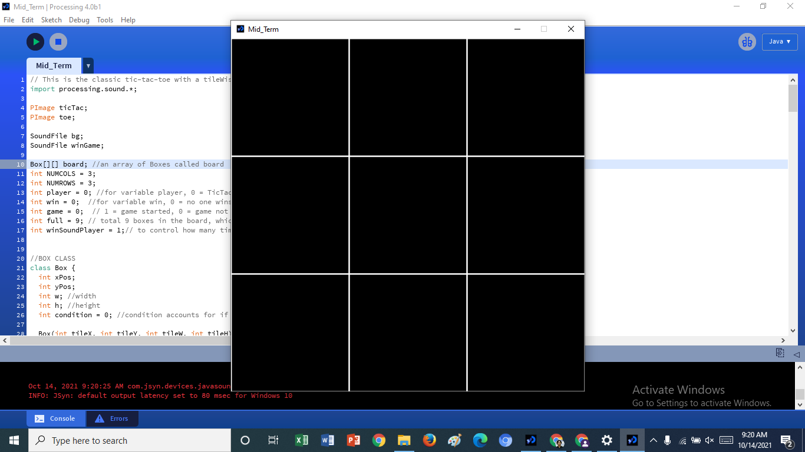
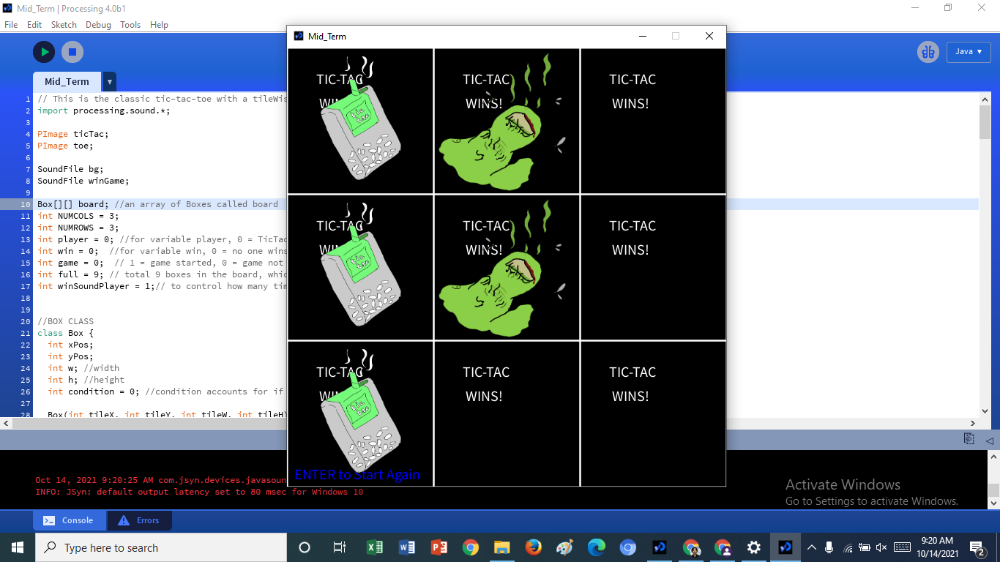

# Modified Tic-Tac-Toe!!

## Concept

The concept behind the game was very simple. It was meant to be the classic tic-tac-toe game with a twist i.e. with tic-tacs and toes instead of circles and crosses.  

## Application

I started by making a box class and making a board array of the box objects. The board is just a simple 3/3 grid of rectangles. The Box objects, depending upon whether the user clicks on them or not and which user clicks on them if they do, can be either empty, or filled with an illustration of a tic-tac or that of a toe. I sketched the illustrations myself using blender.

There's an intro screen which says "Enter to start game". The game begins when the user presses enter. It is played by click the mouse on the different boxes on the board, which fills with either tic-tac or toe in alternating fashion. The game ends when a player gets three tic-tacs or toes lined up vertically, diagonally or horizontally. Whoever wins, the message that they've won is shown inside all the boxes and a message "Enter to start again" appears on the bottom left. When the User presses enter, they're brought back to the intro screen. The game also ends if all boxes are filled and no one wins. 

There's an application of sound in the game as well. When the game starts, a background music is played. It stops when the game ends. If there's a win, a win sound effect is played and if there's no win, nothing is played. 

## Issues

I got one minor issue while designing the game, and it was playing the win sound effect. Because I had to include it in the draw function, it would continue looping forever and if I stopped the loop, the whole game would stop looping and wouldn't restart. So, I created a winSoundPlayer variable and assigned it an integer value of 1. If it is a win and the variable's value is 1, the sound effect plays and increases the value by 1. As such the sound effect didn't loop. There were no problems for the rest of the code. I had to do some debugging while making the board alive, and while making the checkGame() function that checked who won and how they won. 

