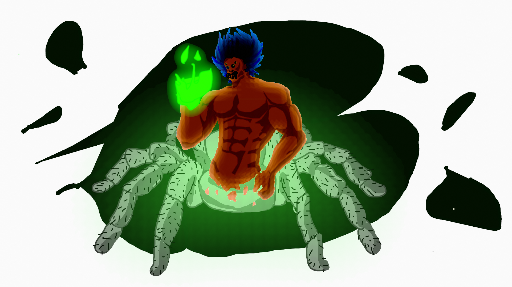

# Intro-to-IM

## **test**



first class program!

````
size(300,400);

//the head
fill(200,200,20);
rect(100,70,100,150);

//the beak
fill(10,200,233);
ellipse(150,185,50,70);
line(125,185,150,200);
line(150,200,175,185);

//the eye whites
fill(255,255,255);
noStroke();
ellipse(120,110,35,50);
ellipse(180,110,35,50);

//the pupil
fill(0,0,0);
circle(120,120,30);
circle(180,120,30);
````
