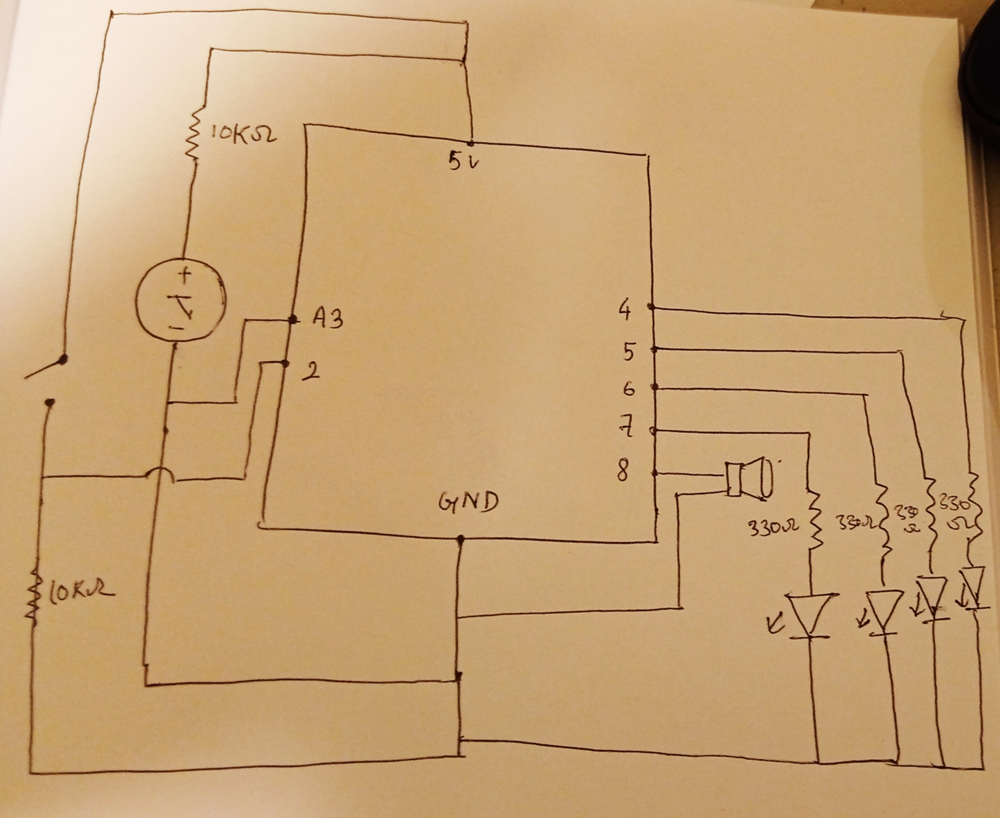
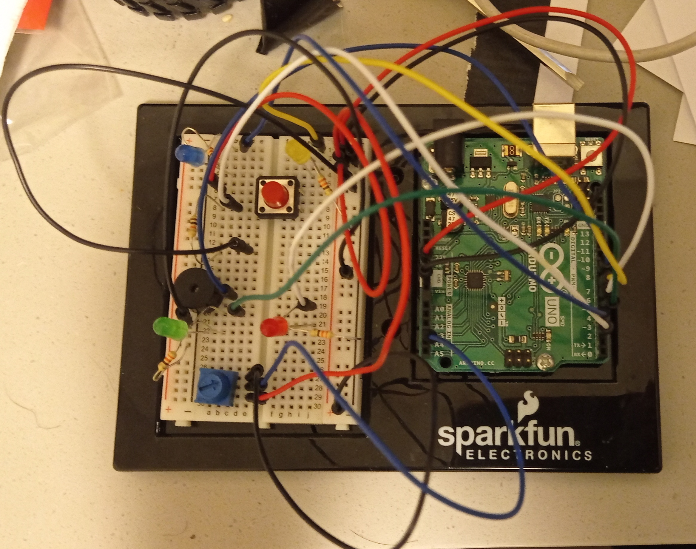
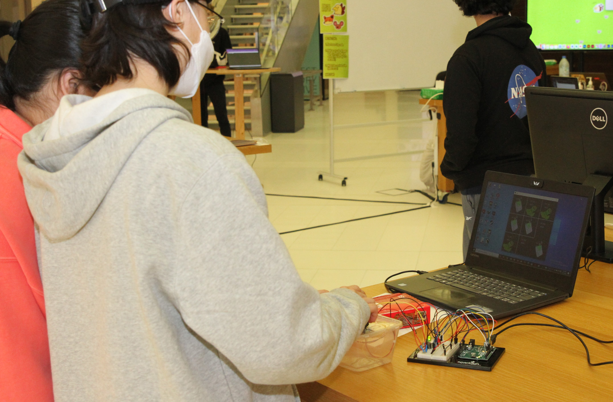

# Tic-Tacs & Toes!

## Concept

My final project was the modified version of my Mid-Term Project, which basically means that it was the same except for it was played through serial communication with Arduino. 

## Using Arduino

The turning of the potentiometer selects the box in which the 'Tic-Tac' or the 'Toe' is to be placed and pressing the switch places the 'Tic-Tac' or the 'Toe'. The game starts with a glowing yellow LED and every time a Tic-Tac is placed, a blue LED glows and every time a Toe is placed, a yellow LED glows. Similarly, in case anyone wins, a Green LED fades in and out and a victory sound effect is played through the Buzzer. In case of a draw, a red LED fades in and out, and a draw sound effect id played through the buzzer. 

## Using Processing

The game will be displayed on a processing window, however it will be controlled through Arduino.

## Difficulties and solving them

- The potentiometer was meant to select the box in which the players place their signs. First, I created a selector box for this that hovers over the boxes of the board. Then, I assigned values to the boxes ranging from 1 to 9 such that when the integer val equals 1, the selector hovers over the first box, for 2, it hovers over the second box and so on. Getting this concept right was the most time consuming thing throughout the implementation of the potentiometer in the game. After this, I simply mapped the potentiometer values to the values of the boxes.
- Another issue arose as I couldn't quite put the LEDs inside the game as I wanted them to. When someone won or the game ended as a draw, either a green (win) or a red (draw) LED was meant to fade in and out continuously. And pressing enter would restart the game, making the fading lights go off. However, the lights kept fading in and out even after pressing enter and restarting the game. I realized that the delay function was what was causing the issue and so I used the millis function instead. I had to change a bit of the code and get rid of all the delays in the code but it worked just fine afterwards.
- At first, an LCD screen was meant to display who won but the LCD screen used up a lot of my breadboard when I first tried it, and later it made it so that I couldn't include the LEDs or the buzzer. So, I got rid of it altogether.
- The smaller potentiometer and the button I'd used initially had to be changed for comfort and aesthetic reasons.

## Schematic

## Pictures

