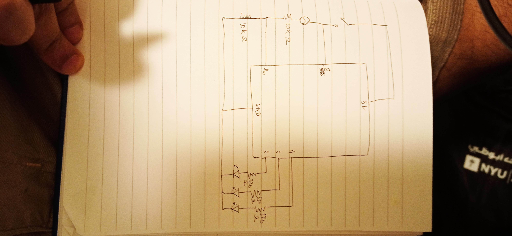
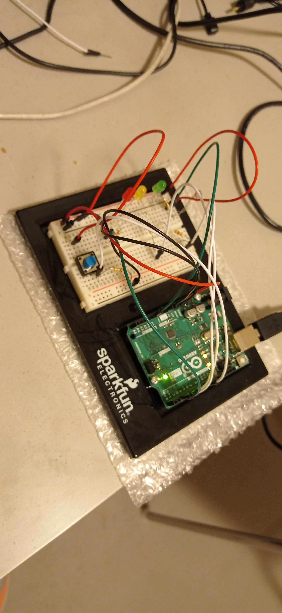
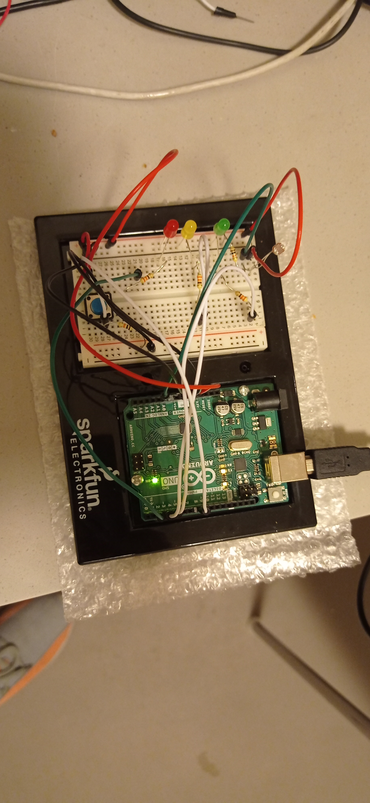

# LED LIGHT-SENSITIVE TRAFFIC LIGHTS

## Concept

The concept behind the project is that when there's excessive light passing through the sensor, you get a red signal and you get a green signal if you significantly block the light passing through the sensor. 

## Application

The project was completed using Arduino. Three LEDs - one red, one yellow and one green were used as the traffic lights. An LDR was used as the light sensor and a switch was used to closed the circuit. When the switch was pressed, the red LED glowed and continued glowing until the light passing through the LDR was blocked. When it was significantly blocked, the red LED turned off and the yellow LED faded in. It stayed lit for a while and faded out. As soon as the yellow faded out, the green LED glowed. As such the project was complete.

I coded the switch to take digital input and the LDR to take analog input. Similarly, the red and the green LEDs gave out digital output whereas the yellow LED gave out digital output.

## Problems

I was having a hard time finding an idea for the project. However, during our class presentations today, Xaoli mentioned the concept of traffic lights. I was inspired from that and built this project. I am thankful to her, and to the Professor for making students present their projects in class. 

At first, assembling the circuit was a hassle but it finally came together somehow and the result was as I had expected.

Other than that, the project went smoothly without much issues.

Link to the video of the project:
https://drive.google.com/file/d/1XmIHoZlvl_8vdnFzWJdNiIQbcLWV2uE3/view?usp=sharing
