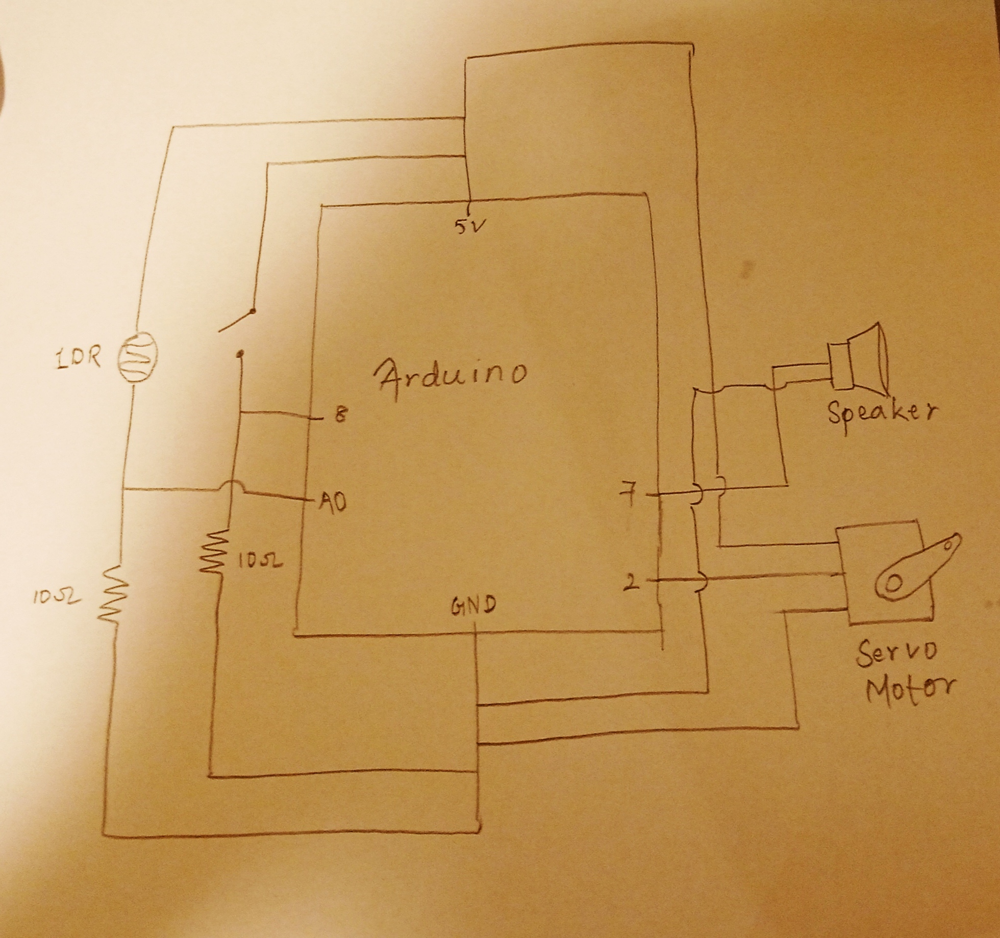
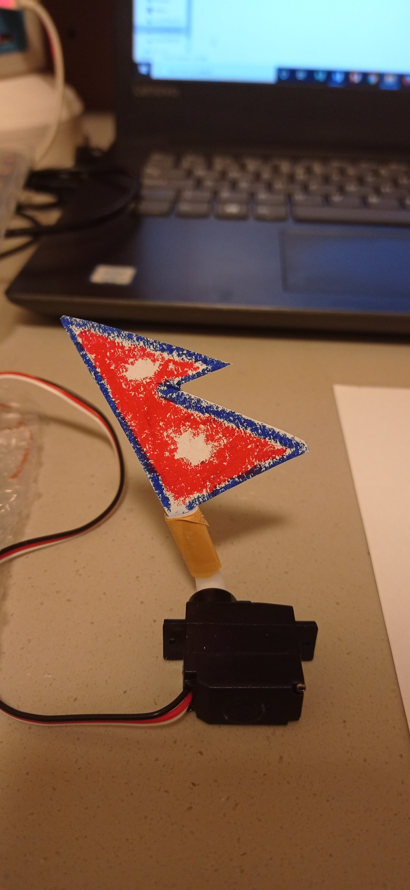
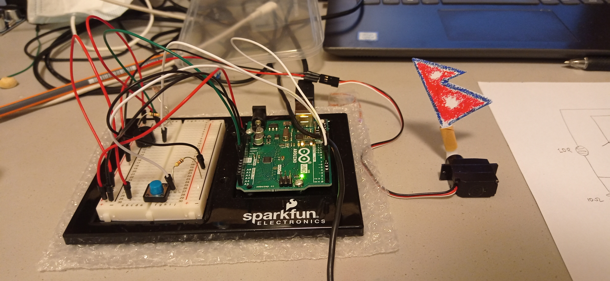
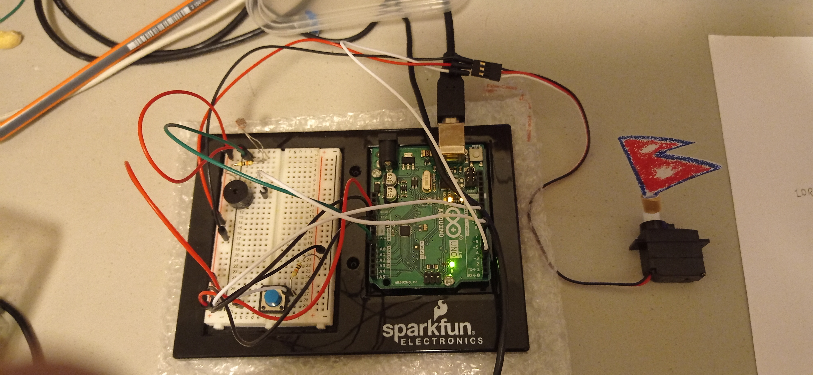

# NATIONAL ANTHEM PLAYER AND FLAG WAVER

## Concept

The concept behind the project is that when there's excessive light passing through the sensor, the instrument will wave the Nepali flag and when there's significantly less light passing through it, the waving will stop and it will play the national anthem of Nepal.

## Application

The project was completed using Arduino. A speaker was used to play the notes and a servo motor was used to wave the flag, which was drawn on paper and cut out. An LDR was used as the light sensor and a switch was used to close the circuit. When the switch was pressed, the servo motor moved and waved the flag attached to it by tape and continued moving until the light passing through the LDR was blocked. When it was significantly blocked, the flag stopped waving and the speaker played a snippet of music. As such the project was complete.

## Problems

The project didn't go as planned because my initial idea was different. I was intrigued when the professor mentioned that the servo motor could be used to make a drumstick-like thing. That idea got stuck in my mind. I had thought that when well lit, the instrument would make a beat through a matchstick attached to the servo motor beating the box in which the Arduino came in. And when the light dimmed, it would play music through the speaker. However, I ended up tearing the Arduino box without figuring out the beat I was going for :(

So, I went ahead with the new idea. Because the code I had envisioned was more or less the same, I could complete the new project quickly without any issues. The matchstick and the Arduino box were replaced by a paper cutout of the flag.

Link to the video of the project:

https://drive.google.com/file/d/1YiFQOJM8dFqVeWIGMtZD7-VqCFKNn068/view?usp=sharing

