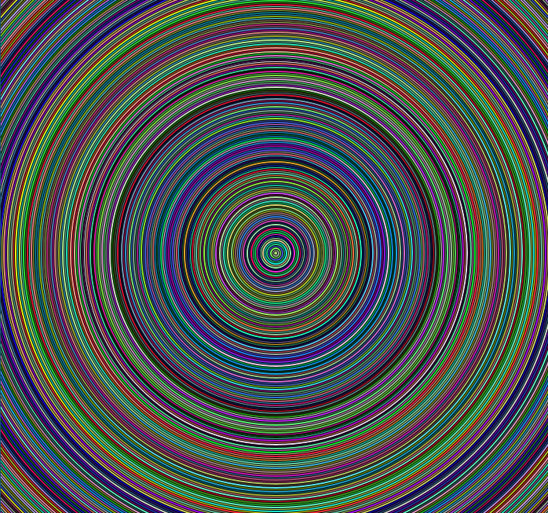

# Process

My intention was to make a seizure-inducing illusion, which came to fruition pretty quickly. I tried the same code but with rectangles at first. However, it didn't work because the origins of the rectangles were at their left hand corners and they shrank into the left hand corner and not into the middle. So, I decided to do it with the circles at the end. You can see streaks stretching towards the left, right, top and the bottom of the figure, but they're not exacctly present in the figure.

# Problems

I did face some issues while making the artwork, which I've listed below:
- The rectangles didn't work and I wanted to have them. I didn't know how to make them converge towards their centres so I went with the circles.
- I'd wished that each circle would have a different colour that wouldn't keep changing after each fram, but I couldn't get that effect.

