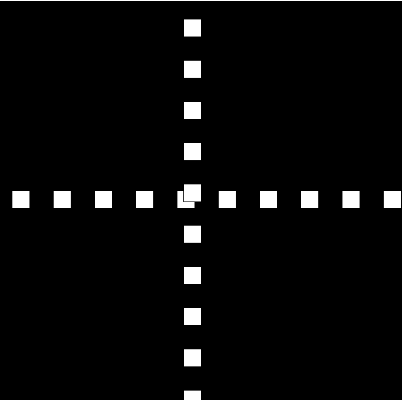

# A Moving System

## Concept:

So the idea behind this project was to create a moving system that would gradually lose kinetic energy with collisions until the energy nullified and the system came to rest. 

## Application:

I created two classes, one for a falling block and one for a block moving horizontally. I gave velocities and energies to the blocks and made sure that after each collision on the walls, the energy decreased. The energy given and the velocity can be changed as they're global constant variables declared at the top. I made a loop to draw not just a single block, but a row of blocks that are falling and a column of blocks that are moving (This was optional for my experiment, I just felt like that would create some interesting patterns on the screen.)

## Result, Surprise and Discovery

When the program was run, the blocks moved as expected - a row fell down vertically and a column moved horizontally. After the first collision, the energy decreased a bit and the slowed down a bit to my relief. And after each successive collision, it kept on decreasing. It became very slow after 8 or 9 collisions. However, it started gaining pace again. It ws quite a surprise as I thought the system would stop moving altogether when the energy was zero. In contrast, the energy was never zero. As a matter of fact, with constant subtraction of the energy, it became negative eventually and instead of slowing down the system, it started speeding it up. The system comes to a rest (or so we assume) when it moves infinitely fast and we can't catch its movement at all. We see the row and the column resting at particular places.

